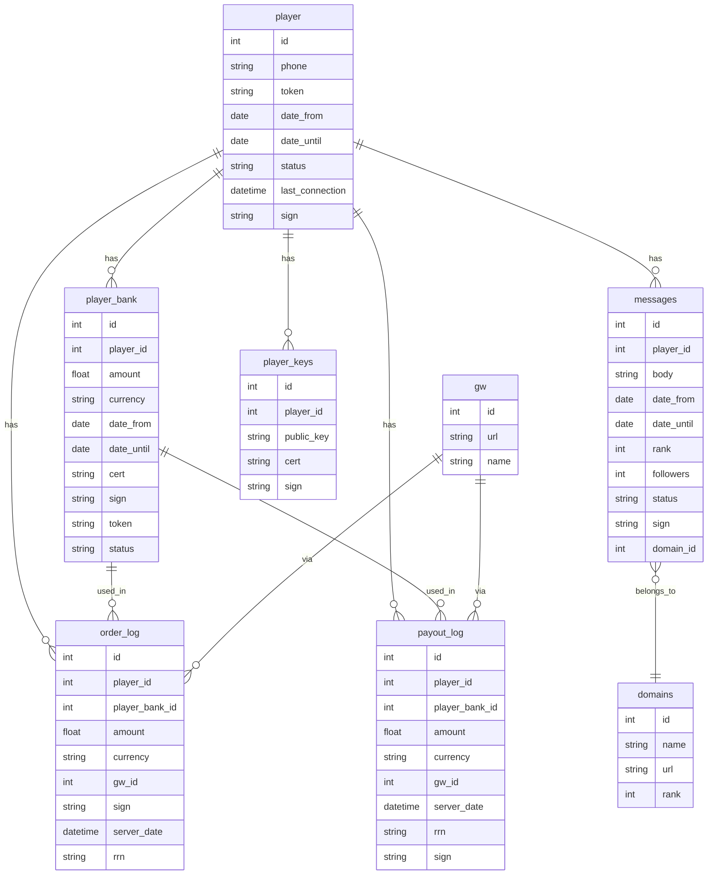

```mermaid
erDiagram
    player ||--o{ player_bank : has
    player ||--o{ messages : has
    player ||--o{ order_log : has
    player ||--o{ payout_log : has
    player ||--o{ player_keys : has

    player_bank ||--o{ order_log : used_in
    player_bank ||--o{ payout_log : used_in

    gw ||--o{ order_log : via
    gw ||--o{ payout_log : via

    messages }o--|| domains : belongs_to

    player {
        int id
        string phone
        string token
        date date_from
        date date_until
        string status
        datetime last_connection
        string sign
    }

    player_bank {
        int id
        int player_id
        float amount
        string currency
        date date_from
        date date_until
        string cert
        string sign
        string token
        string status
    }

    order_log {
        int id
        int player_id
        int player_bank_id
        float amount
        string currency
        int gw_id
        string sign
        datetime server_date
        string rrn
    }

    payout_log {
        int id
        int player_id
        int player_bank_id
        float amount
        string currency
        int gw_id
        datetime server_date
        string rrn
        string sign
    }

    gw {
        int id
        string url
        string name
    }

    player_keys {
        int id
        int player_id
        string public_key
        string cert
        string sign
    }

    messages {
        int id
        int player_id
        string body
        date date_from
        date date_until
        int rank
        int followers
        string status
        string sign
        int domain_id
    }

    domains {
        int id
        string name
        string url
        int rank
    }
```
